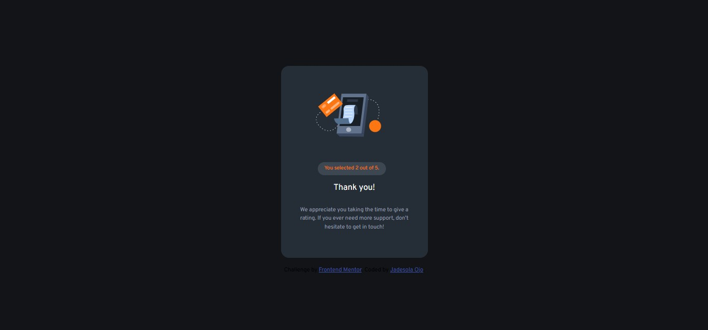

# Frontend Mentor - Interactive rating component solution

This is a solution to the [Interactive rating component challenge on Frontend Mentor](https://www.frontendmentor.io/challenges/interactive-rating-component-koxpeBUmI). Frontend Mentor challenges help you improve your coding skills by building realistic projects. 

## Table of contents

- [Overview](#overview)
  - [The challenge](#the-challenge)
  - [Screenshot](#screenshot)
  - [Links](#links)
- [My process](#my-process)
  - [Built with](#built-with)
  - [What I learned](#what-i-learned)
- [Author](#author)
- [Acknowledgments](#acknowledgments)


## Overview

### The challenge

Users should be able to:

- View the optimal layout for the app depending on their device's screen size
- See hover states for all interactive elements on the page
- Select and submit a number rating
- See the "Thank you" card state after submitting a rating

### Screenshot




### Links

- Solution URL: [Github Repository](https://github.com/Jadesola2/fm-interactive-rating-component)
- Live Site URL: [Github Pages](https://jadesola2.github.io/fm-interactive-rating-component/)

## My process

### Built with

- Semantic HTML5 markup
- CSS custom properties
- Flexbox
- CSS Grid
- JavaScript (event listener)


### What I learned

For this project, I learned to use JavaScript to handle events like clicks and add classes to cetrain tags after some event has occured. I am proud of this code I used to update the page after users have submit their ratings.

```js
// Submit button click 
submit.addEventListener("click", function () {
  if (selectednumber) {
    // hide first screen
    document.getElementById("homepage").classList.add("hidden");
    // show thank you screen
    document.getElementById("thankyou").classList.remove("hidden");
    // update the thank-you message
    document.getElementById("display").innerText =
      `You selected ${selectednumber} out of 5.`;
  } else {
    alert("⚠️ Please select a rating first!");
  }
});
```


## Author
- Frontend Mentor - [@Jadesola](https://www.frontendmentor.io/profile/Jadesola2)
- LinkedIn - [Jadesola Ojo](https://www.linkedin.com/in/jadesola-ojo-862421346)


## Acknowledgments

I would like to thank my mentor [Emmanuel](https://linkedin.com/in/emmanuel-makanjuola-56bb2b297)

